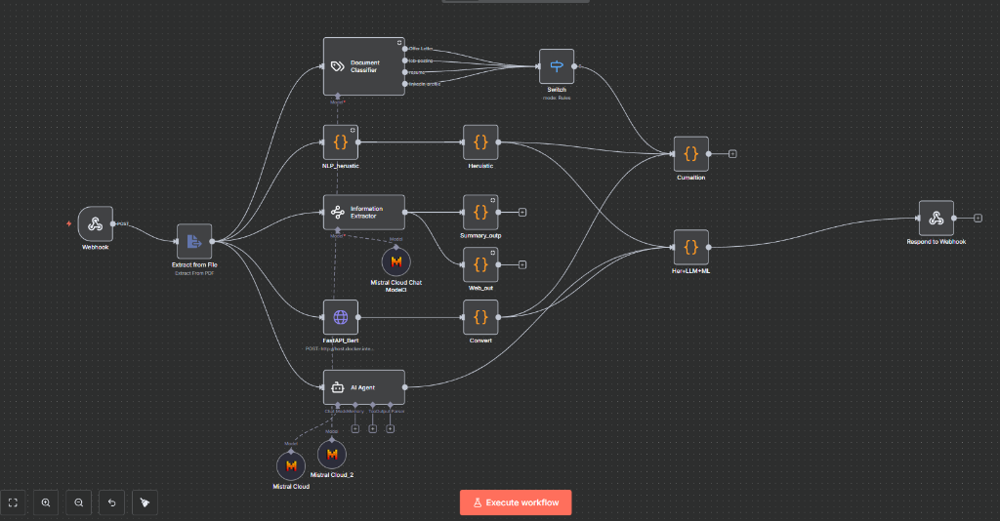

# DeceptiScan - Fraud Job Detection System

DeceptiScan is a high-end, AI-powered platform designed to detect fraudulent job postings, internship offers, and offer letters. It leverages a multi-layered analysis approach combining Heuristic rules, Machine Learning, and LLM-based intelligence to keep job seekers safe.


## 🚀 Features

- **Premium Glassmorphism UI**: A stunning, modern interface with GSAP-powered animations and responsive design.
- **Dual Analysis Mode**: Scan via file upload (PDF/Word/TXT) or raw text paste.
- **N8n Integration**: Seamless communication with an advanced N8n detection workflow.
- **Detailed Intelligence Reports**: Receive granular breakdowns of why a posting was flagged as suspicious or fake.

## 🛠️ Technology Stack

- **Frontend**: React, Vite, GSAP, Lucide React, Vanilla CSS (Glassmorphism).
- **Backend**: Node.js, Express, Multer, Axios.
- **Workflow**: N8n (AI Agents, Mistral LLM, Heuristic Analysis).

## 🤖 N8n Workflow

The system is powered by an advanced N8n workflow that performs deep analysis on the extracted text.

> [!TIP]
> If you encounter `ECONNREFUSED` on the `FastAPI_Bert` node, you can use the built-in **Mock ML Server**!
> 1. In N8n, open the `FastAPI_Bert` node.
> 2. Change the URL to: `http://host.docker.internal:3001/predict` (or your machine's IP).
> 3. The main application will now handle ML predictions automatically.



## 📦 Installation & Setup

1. **Clone the repository**:
   ```bash
   git clone https://github.com/Aryanshh/DecptiScan.git
   cd DecptiScan
   ```

2. **Install dependencies**:
   ```bash
   npm install
   ```

3. **Configure Environment Variables**:
   Create a `.env` file in the root directory:
   ```env
   N8N_WEBHOOK_URL=your_n8n_webhook_url
   PORT=3001
   ```

4. **Build and Run**:
   ```bash
   npm run build
   npm run start
   ```

## 📄 License

This project is licensed under the MIT License.
